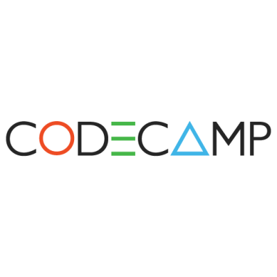

# From device to acting on insights with the Azure IoT platform 
## Techdays 2017 - IoT Hands-on Lab

In this hands-on lab you will be creating the complete chain from configuring, to bridging the cap between the connectivity providers clouds and the Microsoft Azure IoT platform, creating actionable insights on the Microsoft Azure IoT platform and sending commands all the way back to the device. 
This includes assembling hardware, configuring hardware and software and coding the missing logic to a complete IoT solution.
The workshop will simulate a remote located machine malfunctioning and getting restarted based on the received telemetry and created insights based on the telemetry data. 
You will be creating all components to get the malfunctioning machine back up running again. 
All of that within 2-3 hours (2 hours is minimum). 

Technologies used during the hands-on lab; 
• Arduino development boards The Things Uno (LoRa enabled Arduino Leonardo) 
• Software emulated devices/sensors (in Java, NodeJS or C# (UWP)) 
• Sensors (button and LED light bar)
• LoRa & Lora WAN 
• The Things Network cloud
• Microsoft Azure IoT Platform (including Azure Web Jobs, Azure IoT Hub, Azure Stream analytics, Azure Event hub, Azure blob storage and Azure Functions)

This hands-on lab will be guided by Hans Boksem & Jan Willem Groenenberg & Sander van de Velde, so attendees have on site support for questions. 

We will also provide background information about the used components in the hands-on lab. 

The hands-on lab is created in conjunction with Atos and Microsoft Nederland. 

**Hardware used will *remain property* of Atos and Microsoft.**

## Team of experts

During the workshop the following experts will be present to guide you through the workshop:

- [Hans Boksem](https://www.techdays.nl/Sprekers/#7203e568-f3bc-434c-9907-56c7f524e81a); IoT Solution Architect   
- [Jan Willem Groenenberg](https://www.techdays.nl/Sprekers/#1d5fdd7f-b3b3-4902-b6ea-9e06166e5ffc); IoT Solution Architect   
- [Sander van de Velde](https://www.techdays.nl/Sprekers/#4ca5c504-f2d3-404e-b7b8-17ac8ff9d43b); MVP, IoT Solution Architect   

## Workshop schedule at Techdays 2017

| Location | Start Time |  Room  |
| -------- | ---------- | ------ |
| Amsterdam, RAI | OCTOBER 13 2017 08:00H-10:00H | G110 |

## Let's dive into the workshop

The workshop consists of several chapters. The first two chapters will guide you through the essentials we want you to get your hands on. The other chapters are optional/extra if you have time left.

You have four options to choose from to start with. You can either go for physical hardware based on the The Things Uno (Lora/LoraWAN enabled Arduino Leonardo) programmed in C and connected via The Things Network, Or choose one of the device simulation applications like UWP (C#), NodeJS (JavaScript) or Java application (Java is only used for the simulation client). 
 
_(Note: Click on one of the logos to get started with the device or simulated device and follow that path for the rest of the workshop (at the end of each chapter, a link to the following chapter is provided)_

1. **Connecting a device to the Azure IoT Platform**

    <table>
        <thead>
        <tr>
            <th colspan="4">Choose the device to connect</th>    
        </tr>
        <thead>
        <tbody>
        <tr>
            <td>
                
            </td>
            <td>
                
            </td>
            <td>
                
            </td>
            <td>
                
            </td>
        </tr>
        </tbody>
    </table>
    
2. **Receiving and handling telemetry in Azure**

    <table>
        <thead>
        <tr>
            <th colspan="4">Choose the device to receive telemetry from</th>    
        </tr>
        <thead>
        <tbody>
        <tr>
            <td>
                
            </td>
            <td>
                
            </td>
            <td>
                
            </td>
            <td>
                
            </td>
        </tr>
        </tbody>
    </table>

3. **Passing commands back to actual devices or simulated devices**

    <table>
        <thead>
        <tr>
            <th colspan="4">Choose the device to pass commands back to</th>    
        </tr>
        <thead>
        <tbody>
        <tr>
            <td>
                
            </td>
            <td>
                
            </td>
            <td>
                
            </td>
            <td>
                
            </td>
        </tr>
        </tbody>
    </table>

4. **Bonus chapters**
   1. [Deploying The Things Network Bridge to Azure as a WebJob](Webjob.md)
   2. [Add basic monitoring to the IoT platform](IoTPatformMonitoring.md)

 