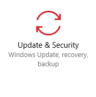
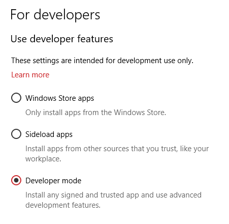

# From device to acting on insights with the Azure IoT platform 
## Developer mode for UWP apps

If you want to be a Windows UWP app developer, you need to have access to the Windows OS you are developping on.

Why? Because when you start developing UWP app and you want to develop/test/run on your own device, you are 'side loading', you are not installing and running apps using the official Windows App Store.

So, before you create your first UWP app, please take some time to activate the 'Developer mode' on your laptop.

1. Navigate to Windows `Settings` on your laptop

  

2. Navigate to `Update and Security` page

  

3. Navigate to the `For developers` tab

  

4. Start using developer features, by selecting `Developer mode`. _(Note: this can cause a reboot of your computer)_

  

Your are now a developer with UWP tools!

More information about about developer features can be found [here](https://docs.microsoft.com/en-us/windows/uwp/get-started/enable-your-device-for-development?ocid=WinClient_Ver1703_Settings_DevMode)

 
